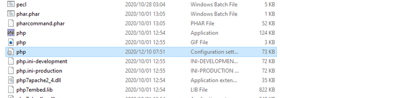
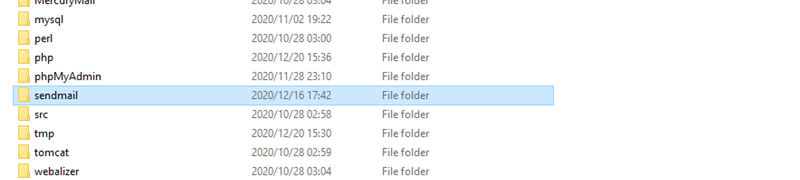

<!-- PROJECT SHIELDS -->
<!--
*** I'm using markdown "reference style" links for readability.
*** Reference links are enclosed in brackets [ ] instead of parentheses ( ).
*** See the bottom of this document for the declaration of the reference variables
*** for contributors-url, forks-url, etc. This is an optional, concise syntax you may use.
*** https://www.markdownguide.org/basic-syntax/#reference-style-links

[![Contributors][contributors-shield]][contributors-url]
[![Forks][forks-shield]][forks-url]
[![Stargazers][stars-shield]][stars-url]
[![Issues][issues-shield]][issues-url]

-->

<!-- PROJECT LOGO -->
<br />

<p align="center">
  <a href="https://github.com/martian1431/camagru">
    
  </a>
  <h3 align="center">Camagru Documentation</h3>
  <p align="center">
    <a href="https://github.com/martian1431/camagru">View Demo</a>
    ·
    <a href="https://github.com/martian1431/camagru/issues">Report Bug</a>
    ·
    <a href="https://github.com/martian1431/camagru/issues">Request Feature</a>
  </p>
</p>

<!-- ABOUT THE PROJECT -->
## About The Project

<!-- [![Product Name Screen Shot][product-screenshot]](https://example.com) -->

Camagru is a sharing site where users can either upload or take photos with their web camera and edit them by adding 'stickers' on top.

<!-- GETTING STARTED -->
## Getting Started

### Prerequisites

A local server to host the application:

### Windows

Install <a href=""> XAMPP </a>

### Linux

Install <a href="">Bitnami LAMP</a>

### MacOS

Install <a href="">Bitnami MAMP</a>

> **_NOTE:_**  
>This application was developed on windows machine, so it might not work properly on other
>operating systems

### Clone

1. Using your terminal cd into htdocs directory
    ```sh
   cd "[Path to XAMPP directory]/htdocs"
   ```
2. Clone the repo
   ```sh
   git clone https://github.com/martian1431/camagru.git
   ```

### Configure server environment

1. Enable sendmail function in php.ini file:
<p align="center">
    
</p>

<p align="center">
    
</p>

<p align="center">
    
</p>

> **_NOTE:_**  
>Insert path to sendmail directory.

2. Configure sendmail function:
<p align="center">
    
</p>
<p align="center">
    
</p>
<p align="center">             
    
</p>

> **_NOTE:_**  
>To use your own google account to configure send mail function you need to enable "Less secure app access" 
>on google under security https://myaccount.google.com/security


### Configure camagru

1. Change the password of $DB_PASSWORD, to the password chosen during from XAMPP/LAMP/MAMP setup.
<p align="center">
    
</p>

2. Start Apache and Mysql servers
<p align="center">
    
</p>
3. Open browser and Go to url <a href="http://localhost/config/setup">http://localhost/config/setup</a> (Windows) or 
<a href="http://localhost/config/setup">http://localhost:8080/config/setup</a> (Linux and MacOS) this will create a database and tables.


### Code Breakdown:

##### *Back End Technologies*

* [Apache HTTP server](https://httpd.apache.org/)
* [Send Mail]()
* [PHP](https://www.php.net/)

##### *Front End Technologies*

* [HTML](https://developer.mozilla.org/en-US/docs/Web/HTML)
* [CSS](https://www.w3.org/Style/CSS/Overview.en.html)
* [Bootstrap](https://getbootstrap.com)
* [Javascript](https://www.javascript.com/)


##### *Database management systems*
* [Mysql](https://www.mysql.com/)
* [phpmyadmin]()

<!-- USAGE EXAMPLES -->
## Tests

  <ol>
    <li>
      These some of the tests that we executed:
      <ul>
        <li>Preliminary Checks, used PHP, used PDOs, config files at correct location</li>
        <li>Webserver starts</li>
        <li>
            The application should allow a user to sign up by asking at least a valid email address,
            an username and a password.
        </li>
        <li>
            At the end of the registration process, an user should confirm his account via a unique 
            link sent at the email address used in the registration form.
        </li>
        <li>User should be able to login using correct credentials</li>
        <li>Capture image with webcam and add sticker before saving.</li>
        <li>Upload Image</li>
        <li>
            Gallery is public and must display all the images edited by all the users, It should also 
            allow (only) a connected user to like them and/or comment them.
        </li>
        <li>
            When an image receives a new comment, the author of the image should be notified by email. 
            This preference must be set as true by default but can be deactivated in user’s preferences.
        </li>
        <li>Change user credentials</li>
      </ul>
    </li>
    <li>
        Expected outcomes:
        <ul>
            <li>Used PHP for backend</li>
            <li>No Framework used</li>
            <li>database.php + setup.php in config folder</li>
            <li>Able to register</li>
            <li>Able to tell the application to send a password reinitialisation mail, if user forget his/her password.</li>
            <li>Able to login only if email account is confirmed</li>
            <li>Able to capture photo</li>
            <li>Able to visit gallery</li>
            <li>Able to change credentials</li>
        </ul>
    </li>
  </ol>

<!-- ACKNOWLEDGEMENTS -->
## Acknowledgements
* [Ruah MVC YouTube Course](https://www.youtube.com/watch?v=rkaLJrYnpOM&list=PLFPkAJFH7I0keB1qpWk5qVVUYdNLTEUs3&index=1&ab_channel=CurtisParham)

<!-- MARKDOWN LINKS & IMAGES -->
<!-- https://www.markdownguide.org/basic-syntax/#reference-style-links -->
[contributors-shield]: https://img.shields.io/github/contributors/martian1431/camagru.svg?style=for-the-badge
[contributors-url]: https://github.com/martian1431/camagru/graphs/contributors
[forks-shield]: https://img.shields.io/github/forks/martian1431/camagru.svg?style=for-the-badge
[forks-url]: https://github.com/martian1431/camagru/network/members
[stars-shield]: https://img.shields.io/github/stars/martian1431/camagru.svg?style=for-the-badge
[stars-url]: https://github.com/martian1431/camagru/stargazers
[issues-shield]: https://img.shields.io/github/issues/martian1431/camagru.svg?style=for-the-badge
[issues-url]: https://github.com/martian1431/camagru/issues
[license-shield]: https://img.shields.io/github/license/martian1431/camagru.svg?style=for-the-badge
[license-url]: https://github.com/martian1431/camagru/blob/master/LICENSE.txt
[linkedin-shield]: https://img.shields.io/badge/-LinkedIn-black.svg?style=for-the-badge&logo=linkedin&colorB=555
[linkedin-url]: https://linkedin.com/in/othneildrew
[product-screenshot]: images/screenshot.png
[product-screenshot1]: images/screenshot1.png 
[last-commit-shield]: https://img.shields.io/github/contributors/martian1431/camagru.svg?style=for-the-badge
[last-commit-url]: https://github.com/martian1431/camagru/graphs/contributors
